# Printing your own lenses

**How the Lenticular Print and Lens Grid Print nodes work, and how to do it yourself.**

A UV flatbed printer lays down ink and cures it on the spot, so it can build a stack of clear
varnish — a physical relief — usually up to somewhere between half a millimetre and two, at 600 to
1440 dots per inch. A machine that can build a transparent relief that finely can build **lenses**.
And if it prints the lenses onto the picture it just printed, in the same job, the two line up
perfectly by construction.

That's the whole idea. This guide explains what has to be true for it to work, why the maths comes
out the way it does, and what to do on your own printer.

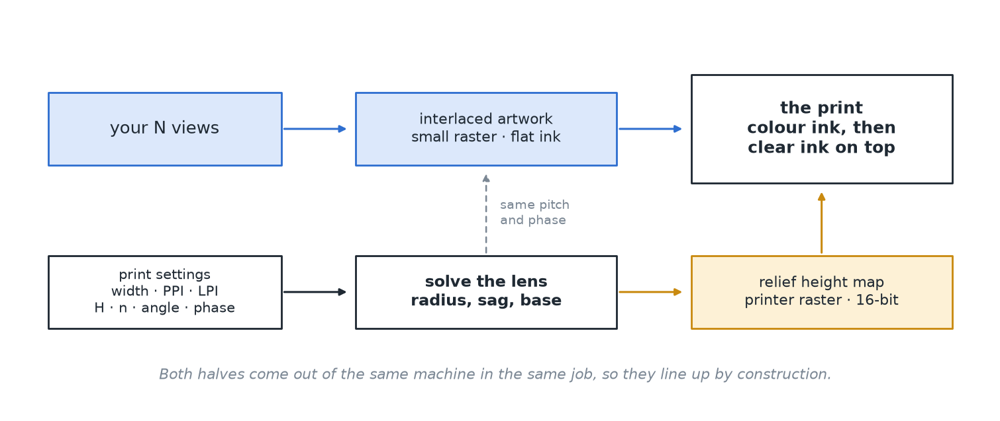

Everything here is MIT-licensed, like the rest of the repository. There's a note on prior art and
licensing [at the end](#prior-art-and-licence).

---

## Contents

- [What comes out](#what-comes-out)
- [Why printing the lens changes the problem](#why-printing-the-lens-changes-the-problem)
- [Solving the lens](#solving-the-lens)
- [When it can't work](#when-it-cant-work)
- [How wide the view is](#how-wide-the-view-is)
- [Interlacing](#interlacing)
- [Two rasters, two jobs](#two-rasters-two-jobs)
- [How big is too big](#how-big-is-too-big)
- [Why the relief needs 16 bits](#why-the-relief-needs-16-bits)
- [Angle and phase](#angle-and-phase)
- [The two-dimensional version](#the-two-dimensional-version)
- [Rendering the views from a model](#rendering-the-views-from-a-model)
- [Calibrating](#calibrating)
- [The numbers, at the defaults](#the-numbers-at-the-defaults)
- [Doing it yourself](#doing-it-yourself)
- [When it goes wrong](#when-it-goes-wrong)
- [What this doesn't do](#what-this-doesnt-do)
- [Where the code is](#where-the-code-is)

---

## What comes out

You give the tool N images — the **views** — and some print settings. It gives you two files:

- the **interlaced artwork**, which you print in colour ink;
- the **relief height map**, a 16-bit greyscale image, which you print on top in clear ink.

Here's what that makes, in cross-section. This is drawn at true scale from the real solution at the
tool's defaults, so the proportions are honest — the lens really is that shallow relative to the
stack it sits on.

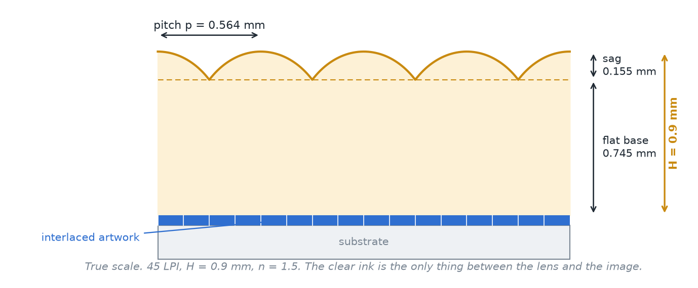

Three things to notice, because everything else follows from them:

1. The clear ink is the **only** thing between the lens and the picture. There's no substrate in
   between, the way there is when you laminate a lens sheet on top of a print.
2. The lens doesn't fill the whole height. Most of it — 0.702 mm of the 0.9 mm here — is a flat
   base layer, and the actual curve is only the top 0.198 mm.
3. Under each lens the artwork is chopped into strips, one per view.

---

## Why printing the lens changes the problem

With a laminated lenticular sheet you pick a lens and the substrate thickness comes with it: the
manufacturer has already arranged for the focal plane to land on the back face, where you stick your
print. Your job is alignment — matching your interlace to their pitch, which is why the trade has
such elaborate pitch-test rituals.

Printing the lens removes the alignment problem entirely. The pitch is whatever your file says,
because the same machine makes both halves in one pass.

But it introduces a different constraint. The distance from the lens apex down to the image is now
the **ink stack itself**, and the ink stack is limited by what your printer and your varnish can
build. You don't get to choose it to suit the lens; the lens has to suit it.

That single substitution is what makes the rest of this document. It turns "pick a lens sheet" into
a small piece of algebra with a real, binding constraint attached.

---

## Solving the lens

Start with the focus. A curved surface between air and a material of refractive index `n` bends
incoming parallel light to a point. For a single refracting surface of radius `R`, that point sits at
`n·R / (n − 1)` past the surface, measured inside the material. The flat back of the stack is in
contact with the artwork, so it adds no power — the focus stays where the curve put it.

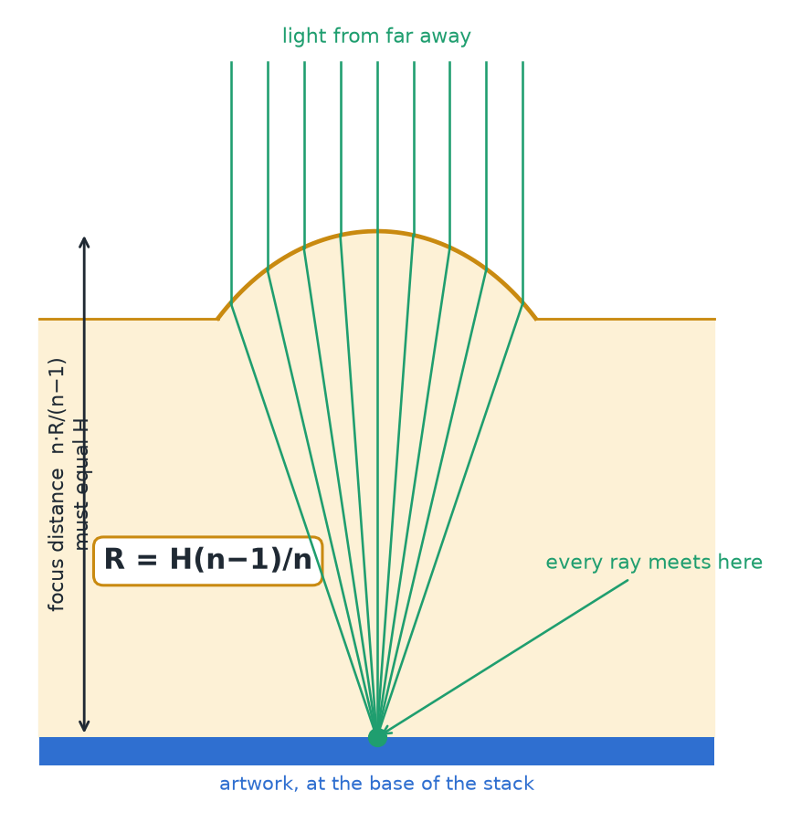

We want that focus to land exactly on the artwork, which is `H` below the apex. Setting the focal
distance equal to `H` gives you the radius immediately:

```
R = H (n − 1) / n
```

That's worth pausing on. **The radius depends only on the stack height and the refractive index.**
Not on the pitch, not on how many views you have. Given 0.9 mm of varnish at index 1.5, the surface
is a piece of a sphere of radius 0.3 mm, and that's that.

The pitch decides how much of that sphere you use. A circular arc across a chord of width `p`, rising
to a height `s` in the middle (the **sag**), has radius:

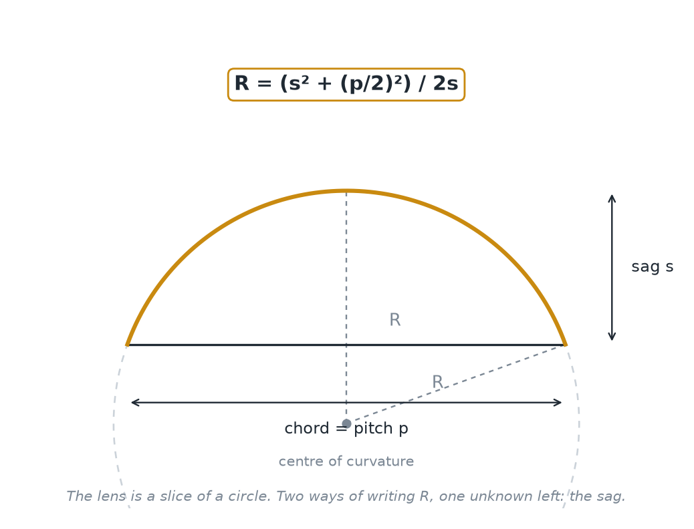

```
R = (s² + (p/2)²) / 2s
```

Two expressions for `R`, one unknown left. Eliminating it gives a quadratic in the sag:

```
n·s² − 2H(n−1)·s + n·p²/4 = 0

        H(n−1) − √( H²(n−1)² − n²p²/4 )
  s  =  ───────────────────────────────
                      n
```

and the flat base underneath is just `b = H − s`.

### Why the minus sign

The quadratic has two roots and both are real solutions — they're the minor and major arc of the
_same_ circle, since both share the radius fixed above. The larger root has a sag bigger than the
radius, which means a surface more than hemispherical: a sphere on a stalk. Not printable, not
useful. Always take the minus root.

---

## When it can't work

Look at the square root. If `H²(n−1)² < n²p²/4` there's no real answer, and rearranging tells you
exactly when:

```
H  ≥  n·p / (2(n − 1))
```

This isn't a numerical quirk, it's physics. As `H` drops toward that bound the sag grows to `p/2` — a
hemisphere, the strongest lens you can make across that chord. Below it, no surface of any shape
spanning that pitch focuses that shallow.

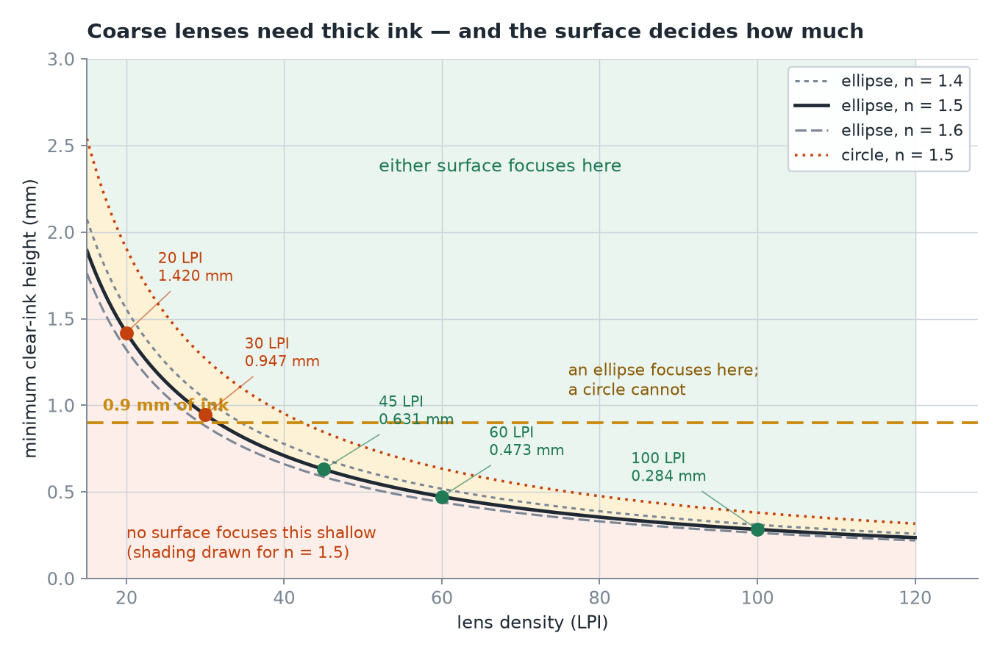

The floor is **linear in the pitch**, so it's inversely proportional to LPI. Read that off the chart
and it says something that surprises people coming from laminated lenticular: **coarse lenses need
thick ink.** A 20 LPI lens needs 1.9 mm of varnish. At a realistic 0.9 mm budget you can't go
coarser than about 42 LPI, and the tool's 45 LPI default sits just 6% above the floor.

If you ask for something impossible, the tool doesn't refuse — it prints the strongest lens it can (a
hemisphere), tells you where that actually focuses, and tells you the height you'd need. A print
that focuses at the wrong depth is blurry, not ruined, and seeing it is more useful than an error.

---

## How wide the view is

The cone you can move through before the image stops flipping is set by the marginal ray: the one
from the focus out through the edge of the lens, refracted back into air.

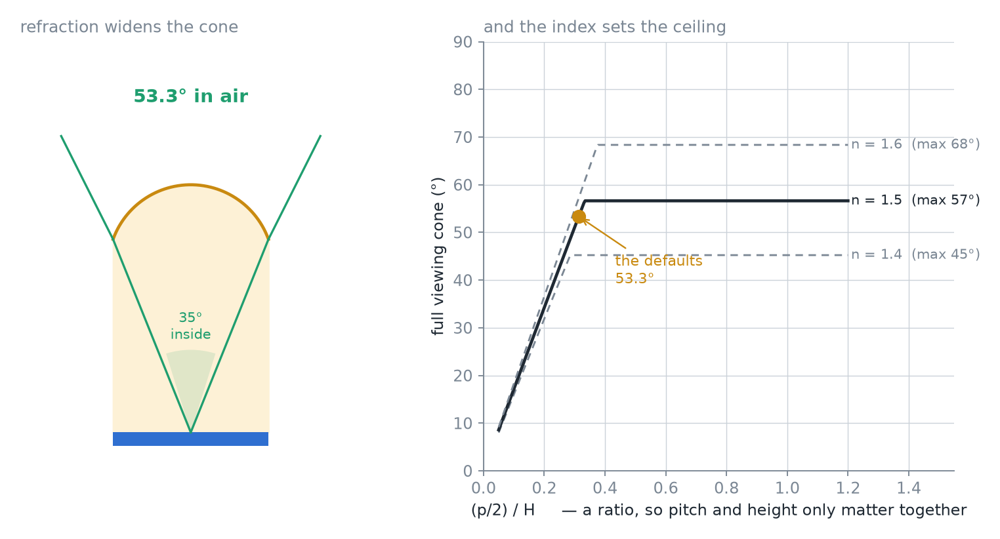

```
sin(θ/2) = n · sin( arctan( (p/2) / H ) )
```

Both this and the feasibility floor depend on the pitch and the height **only through their ratio**.
Halve both and nothing changes — same lens shape, same margin, same cone. That has two consequences
worth knowing:

**The refractive index sets a ceiling nobody can beat.** At the feasibility floor the sag is `p/2`
and the cone is as wide as it gets: 45° at n = 1.4, **57° at n = 1.5**, 68° at n = 1.6, 81° at
n = 1.7. No choice of pitch or height gets you past those.

**Any cone you can reach at one pitch, you can reach at every pitch**, by scaling the height in
proportion. That sounds academic; it turns out to matter a lot for [calibration](#calibrating).

---

## Interlacing

Now the artwork. Each lens covers a strip of it, and that strip is divided into N tiles, one per
view. Where your eye is decides which tile the lens shows you.

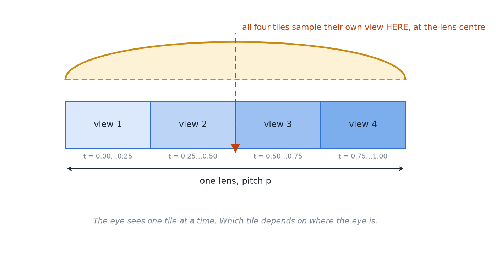

Here it is moving — one frame per degree, across the lens's own 53.3° cone and a degree past each
edge. The whole aperture of each lenticule is traced, by Snell's law at the real arc: green where a
ray lands in the strip the eye is being shown, amber where it does not. The strips are coloured by
where their view was captured, blue from the left of the cone and orange from the right.

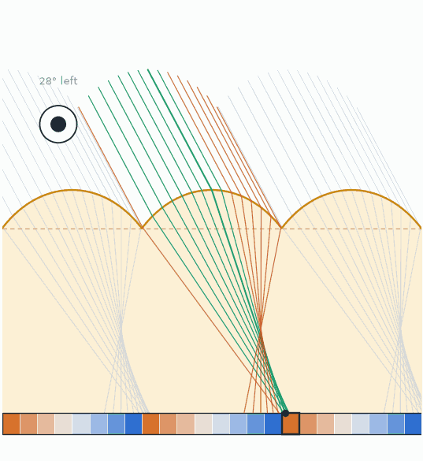

Watch the two directions disagree. The eye walks **right**; the bundle lands **left** of the lens
axis, so it reads a strip nearer the left of the lenticule, which is a *low* strip number — and a low
strip number carries a view captured from the **right**, because the run is printed reversed. The lit
strip's colour is always the colour of the side the eye is on. That is the whole reason for the
reversal, and a print made the other way round is one where those two stop agreeing.

The frames at each end are just outside the cone: the bundle has walked onto the next lenticule's
strips, which is where the print repeats. _Regenerate with `python docs/animation.py`._

### The blur the lens itself adds

All that amber is the honest problem. A circular cap does not bring its aperture to a point: the
outer rays cross the axis nearer the lens than the middle ones do, which is **spherical aberration**,
and it is a property of the shape rather than of the printing. Traced across the full aperture of the
tool's default lenticule, head-on, the bundle lands over **269 µm** — and at twelve views a strip is
47 µm, so the light meant for one view is spread over **5.7 of them**. Off-axis it is worse: 446 µm,
9.5 strips, at the edge of the cone.

That is not a small correction. It is why a lenticular print reads as several views blended rather
than one view at a time, and it is the reason the practical view count of a print is far below what
the raster could carry.

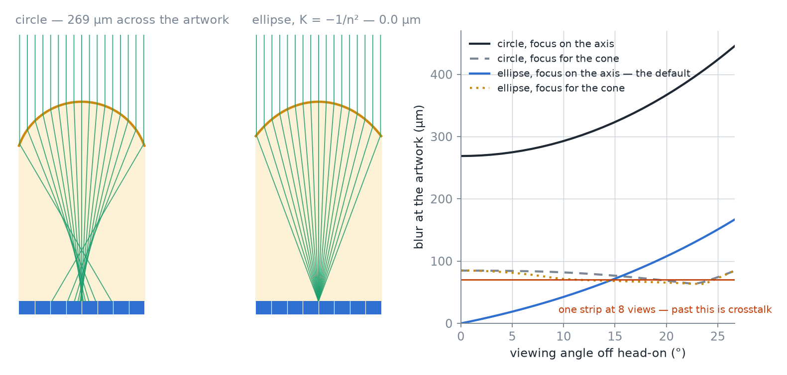

Four things reduce it, and they are not equally good:

| Surface                                           | Blur head-on        | Worst across the cone | What it costs    |
| ------------------------------------------------- | ------------------- | --------------------- | ---------------- |
| circle, focus on the artwork _(as printed today)_ | 269 µm · 5.7 strips | 446 µm · 9.5 strips   | —                |
| circle, radius set for **best focus**             | 30 µm · 0.6         | 174 µm · 3.7          | ~13% of the cone |
| **ellipse**, `K = −1/n²`, same vertex radius      | **0 µm**            | 167 µm · 3.6          | nothing          |
| ellipse, radius re-optimised over the cone        | 85 µm · 1.8         | **86 µm · 1.8**       | ~13% of the cone |

**Change the shape.** An ellipse, not a circle, is the exact answer for the on-axis point: for one
refracting surface bringing collimated light to a focus inside a medium of index `n`, the conic that
does it perfectly has conic constant `K = −1/n²` — −0.444 at n = 1.5. That is textbook single-surface
optics, and it is precisely what the lenticular patents claim, together with the same
`t = R·n/(n−1)` thickness condition this document derives in
[Solving the lens](#solving-the-lens) ([US6795250B2](https://patents.google.com/patent/US6795250B2/en)).
Traced here it removes the head-on blur **entirely** — 269 µm to 0.0 — and still cuts the worst case
across the cone by 2.7×, with coma the residual, exactly as that patent says.

The remarkable part is what it costs, which is nothing. The ellipse has the same vertex radius, so
the same focal length and the same cone; its sag is 43 µm shallower, so the flat base under it grows
by 43 µm and the stack is the same 0.9 mm. On a laminated sheet you take the profile the extruder
made. Here **the profile is a height map** — an aspheric costs exactly as many bytes as a sphere.
Adding it to this tool is a change to one function, `renderCapDepthMap`, plus a setting.

**Move the focus.** Cheaper still, and available today: put the artwork at the circle of least
confusion instead of at the paraxial focus. For this lenticule the tightest plane is 180 µm above the
paraxial focus, so solving the radius from `best focus = H` rather than `paraxial focus = H` — R
0.347 mm instead of 0.300 — turns 269 µm into **30 µm**, a ninefold improvement for a different
number in the same formula. It is not free: the lens is weaker, so by the marginal-ray measure this
document uses the cone narrows from 53.3° to 46.2°.

**Stop the aperture down.** Blur falls fast with aperture — 80% of the pitch gives 88 µm, 60% gives
30 µm — which is the standard advice in the display literature: increasing the radius of curvature or
decreasing the aperture suppresses the aberration and the crosstalk with it
([SPIE 8384](https://ui.adsabs.harvard.edu/abs/2012SPIE.8384E..19L/abstract)). But the aperture _is_
the cone here: 60% of the pitch is a 32° cone instead of 53°, and 40% of the light thrown away. On a
printed lens you would do it by leaving a flat gutter between lenticules, which is also 40% of the
sheet not focusing anything. Usually the wrong trade.

**Raise the index.** Blur falls steeply with `n`: 133 µm at 1.6, 85 µm at 1.7, against 269 µm at 1.5
— and the cone _widens_ at the same time. This is the one lever with no downside except availability;
UV clear inks sit near 1.5, and 1.6+ means a different chemistry.

**Or spend fewer views.** The blur only matters against the width of a strip. The same 269 µm is 5.7
strips at twelve views and 2.9 at six. Half the views, half the crosstalk — and it is worth knowing
that a print with fewer, cleaner views often reads as sharper than one with more, blended ones.

Everything above is traced rather than asserted: the figure and the table come out of
`fig_aberration()` in `docs/figures.py`, over the same `Lens` solve the tool ships. Beyond a single
surface the display literature goes further — acylindrical arrays corrected across a 30–60° field,
and triplet lenticules for low-crosstalk multi-view printing — but a printed relief _is_ a single
surface, so the ellipse is the whole of what is available here, and most of what is available
anywhere:

- [Lenticular lens array, US6795250B2](https://patents.google.com/patent/US6795250B2/en) — the
  elliptical cross-section, `κ = −1/N²`, and the junction-depth argument.
- [Method of crosstalk reduction using lenticular lens, SPIE 8384](https://ui.adsabs.harvard.edu/abs/2012SPIE.8384E..19L/abstract)
  — radius of curvature and aperture against aberration and crosstalk.
- [Correction of aberrations in lens-based 3D displays](https://www.researchgate.net/publication/252774709_Correction_of_aberrations_in_lens-based_3D_displays)
  — aspheric and acylindrical arrays over a wide field.
- [Low-crosstalk super multi-view lenticular printing using triplet lenticular lens](https://www.sciencedirect.com/science/article/abs/pii/S0030402619315645)
  — what more than one surface buys.

Walking across the sheet at position `u` (measured across the lenses), the arithmetic is:

```
σ = u / p + phase     j = ⌊σ⌋          which lens
                      t = σ − j        where you are inside it, 0…1
                      k = ⌊t · N⌋      which view's tile
```

### The part that's easy to get wrong

Each tile does **not** sample its view at the tile's own position. Every tile of a given lens samples
its view at **that lens's centre**:

```
u_centre = (j + 0.5 − phase) · p
```

It's worth being concrete about why, because the naive version looks perfectly reasonable and
produces a print that's subtly, annoyingly wrong.

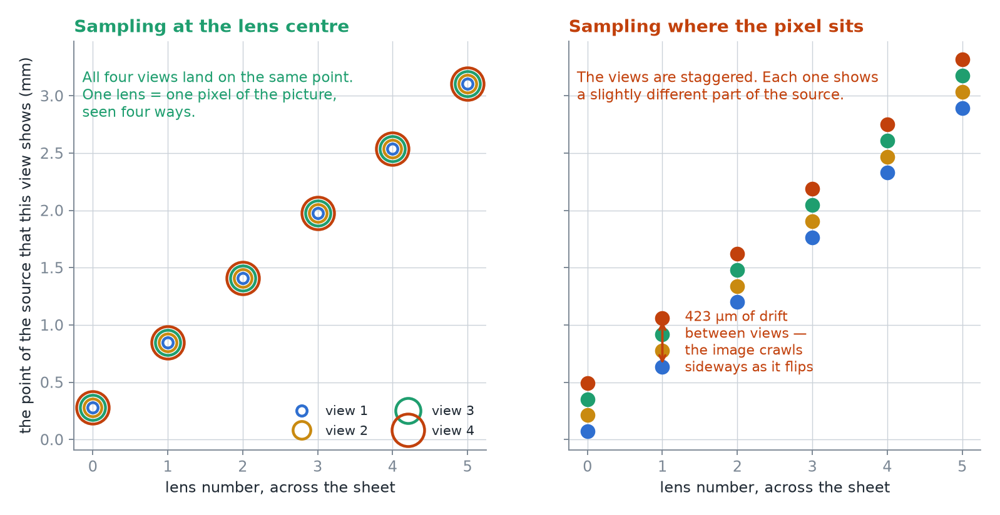

Sample at the lens centre and all N views agree on which point of the picture that lens represents —
one lens is one pixel of the final image, seen N ways. Sample where each pixel happens to sit and the
views are staggered by `p/N`, so as the print flips, the whole image slides sideways by 423 µm. You'll
see it, and you'll spend a while blaming your printer.

This also tells you the resolution you're going to get. **The number of lenses is the width of each
view.** A 100 mm print at 45 LPI is 177 lenses across, so each view is 177 pixels wide, and no amount
of source resolution changes that. (Vertically, a lenticular keeps everything — a cylinder doesn't
resolve anything along its own length. The [2D version](#the-two-dimensional-version) is not so
generous.)

---

## Two rasters, two jobs

The two output files are deliberately different sizes.

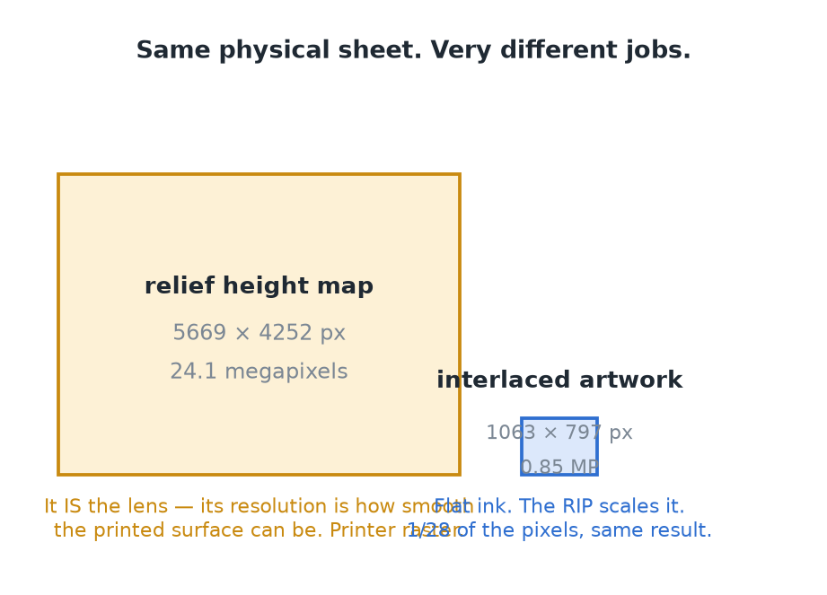

The **relief** has to sit on the printer's own raster, because it _is_ a physical surface. The pixels
across one lens — `PPI / LPI`, which is 32 at the defaults — are the steps you have to shape the
curve with. Fewer than about 8 and the lens visibly terraces.

The **artwork** carries no geometry at all. It's flat ink that the RIP will scale onto the sheet, so
it only needs to be big enough that (a) no view tile gets skipped, which means at least 2 pixels per
tile, and (b) you never resample your sharpest source view downward. At the defaults that's 1063
pixels where the relief needs 5669 — about a twenty-eighth of the data for exactly the same print.

### Except when the strips run diagonally

That twenty-eight-fold saving hides an assumption: it holds only while the strips line up **with the
pixel grid**.

Count pixels per strip and orientation looks irrelevant. Pixels are square, so two pixels across a
strip measured along x are two pixels across it at any angle, and no strip is ever skipped. That is a
statement about **sampling density**, and it is true. It says nothing about **placement**.

Turn the array and every boundary between two frames becomes a diagonal. A pixel straddling a diagonal
belongs to two frames and can be printed as only one of them — whichever one its centre happens to
fall in. So the boundary isn't a line, it's a staircase:

```
   want                  coarse raster              printer's raster
   ╲   A ╲   B           ┌───┬───┬───┐              ┌─┬─┬─┬─┬─┬─┬─┬─┐
    ╲     ╲              │ A │ A │ B │              │A│A│A│B│B│B│B│B│
     ╲     ╲             ├───┼───┼───┤   error up   ├─┼─┼─┼─┼─┼─┼─┼─┤   error up to
      ╲     ╲            │ A │ B │ B │   to ½ px    │A│A│B│B│B│B│B│B│   ½ printed dot
```

Half a pixel of misplacement doesn't sound like much until you price it in strips. The minimal raster is
_defined_ as `q` = 2 pixels per strip, so half a pixel is **a quarter of a strip** — a quarter of one
view's slot in the flip, misassigned. On the PPI raster the same half pixel is half a printed dot: 32
pixels span a lens at the defaults, so it is 1/64 of one.

It doesn't average out, either. Every lens down the sheet is misassigned in the same direction, so it
reads as a ragged edge with a long, regular period rather than as noise — and a strip under a lens is a
whole view, so the reading eye gets the wrong one of them along that boundary.

More pixels are the only cure, and there is exactly one amount past which they stop helping: **the
printer's own raster**. Beyond it the extra pixels never reach the paper, so that is the ceiling —
for a diagonal sheet and an axis-aligned one alike.

It is a ceiling and not a destination, though, and that distinction is the whole of the sizing rule:

```
wanted        = max( interlace floor,  sharpest source )
artwork width = wanted, rounded so every lenticule gets the same whole number
                of pixels — and never bigger than the PPI raster
```

So the artwork is as big as the interlace and your own images need, and never bigger than the press
can print.

That rounding is not a detail, and it is worth being exact about why. The frame a pixel belongs to is
`floor(frac(u / p) · N)`, so what fixes a strip boundary inside a lens is the pixel *offset* of that
lens. Let a lenticule be 5.08 px wide and lens 0 starts on a pixel boundary, lens 1 starts 0.08 px
late, lens 12 a whole pixel late — so each rounds its boundaries somewhere slightly different and
flips at a slightly different angle. Tilt that print and the change sweeps across it as a band: half
the picture has switched and half has not. It reads as a wipe, and it is the most common reason a
home-made lenticular looks broken.

Give every lens a whole number of pixels and it goes away. Every lenticule then covers an identical
run of pixel columns, every boundary sits at the same offset under every lens, and the sheet changes
all at once. Rounding the pitch up to a whole number of pixels *per strip* is better still, since the
views then get equal shares of the lens; where the press cannot carry that, whole pixels per lens is
enough for the sheet to switch as one, with the strips inside a lens merely uneven (3, 3, 2, 3, 3, 2
across a 16 px lens of six views) — and identically uneven under every lens, which is what matters.

The lens grid and the radial array are sized the same way — whole pixels per *cell*, and a whole
number per tile column where the press allows it — with one difference that is worth knowing before
you choose a packing. A square array's rows sit one pitch apart, the same as its columns, and the
artwork keeps the sheet's aspect: align it across and it is aligned down for free, so the print
switches as one in both axes. A hex array's rows sit √3/2 of a pitch apart, and √3/2 is irrational,
so **no raster has whole pixels between rows as well as between columns**. A hex sheet is therefore
aligned across and drifting down: tilt it left and right and it switches together, tilt it up and
down and the change sweeps through the rows. That is the price of the 15% more lenslets hex buys —
exact, not a matter of degree — and square packing is the way out of it.

(The `- 1e-9` before that ceiling is real and not a flourish. A 25.4 mm sheet at 12 LPI computes as
11.999999999999998 lenticules, and an exact fit that rounds up because of it costs half as many
pixels again for nothing.) A diagonal sheet is welcome to more pixels than that — its staircase is as fine as the
raster it is drawn on — but it does not get them behind your back, because the difference between a
1063-pixel artwork and a 5669-pixel one is a factor of 28 in memory, render time and file size, and
that is a decision rather than a detail. **Artwork px per strip** (or per view tile) is the dial:
raise it and the raster climbs, up to the cap.

| Sheet                                            | Artwork raster at the defaults         |
| ------------------------------------------------ | -------------------------------------- |
| Lenticular, 3 views, any angle                   | 1063 px — every edge placed to ¼ strip |
| …same, with Artwork px per strip at 8            | 4252 px — placed to a sixteenth        |
| 2D grid, 3 × 3, square packing                   | 1063 px                                |
| 2D grid, 3 × 3, [hex packing](#packing-the-caps) | 1228 px (the √3/2 row spacing)         |
| 2D grid, 15 × 15, hex                            | 5669 px — the cap; it wanted 6138      |

Both print nodes report which raster they landed on, whether that is the cap, and — when the edges
are diagonal — that spending more would still buy something.

The [radial array](#the-two-dimensional-version) is sized the same way, and it is the one where
spending up to the cap is most often worth it. A wedge boundary is a radial line: there is no
orientation at which it runs along the pixels and no raster at which it is free, and the wedges
converge to a point at every lenslet centre. Its floor puts `Artwork px per wedge` across a wedge at
the **rim**, where a wedge is widest — 26 px for a four-view ring at the test settings, against the
100 px the press could print — so if the seams look stepped, that setting is the one to raise.

### How big is too big

Those rasters grow with the square of the sheet: a 100 mm print at 1440 PPI is 24 MP of relief, a
300 mm one is 217 MP, and every pixel of artwork costs four bytes with two more for the relief. So
there is a line, and it sits at **80 MP** per raster.

The line is not a refusal, though. Over it the tool stops, says how big the raster would be and how
many chunks the work divides into, and lets you decide — because "300 mm at 1440 PPI" is sometimes
exactly what you meant. Say yes and the render runs a band of rows at a time: a progress bar counts
the chunks off on the node, the tab stays responsive between them, and Cancel still works. What it
cannot do is conjure memory, so there is a second line at 500 MP that nothing gets past — a raster
that size is a two-gigabyte buffer, and the honest answer is a number rather than a dead tab.

The same question comes up for the calibration sheets in the print editor, which are full-size prints
in their own right, and it is asked the same way.

Chunking is not only for the oversize case. Every print render runs in bands of rows whatever its
size, and the two model renderers run **one view per chunk** — a 15 × 15 grid is 225 passes over the
mesh, and at half a second each that is two minutes in which nothing would paint and Cancel would
not work. A node mapped over an animation does the same, one frame per chunk. The rule throughout is
that no single chunk holds the main thread for long, so the progress figure moves and the tab stays
alive.

---

## Why the relief needs 16 bits

A browser canvas is 8-bit, so this repository carries its own small 16-bit PNG writer. Here's why
that was worth the trouble:

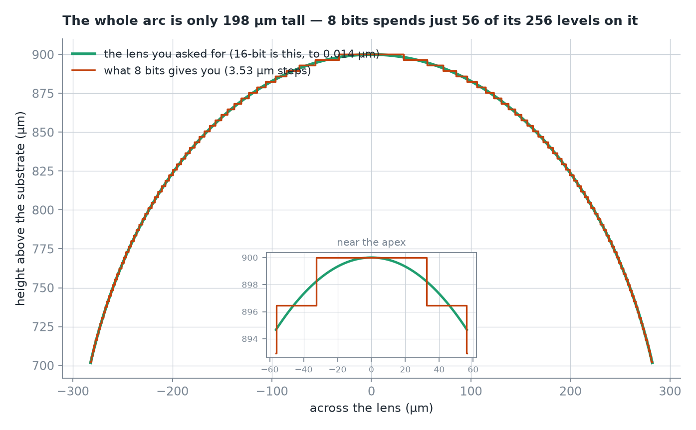

The whole lens arc is 198 µm tall on a 0.9 mm stack. Eight bits gives you 256 levels over that
0.9 mm, so the arc gets 56 of them — steps of 3.53 µm, on a surface whose job is to focus light.
Sixteen bits gives you steps of 0.0137 µm, which is far below anything the ink can hold.

Two practical notes:

- Ask your RIP what bit depth it reads for the varnish channel, and what height full white
  corresponds to, before you print anything.
- The tool writes the height that 65535 means into the filename, because on a calibration sheet it
  varies.

---

## Angle and phase

**Orientation** rotates the whole array. Because the maths is all done in millimetres in a rotated
frame, this is one parameter with no special cases — set it to 90° and you get a horizontally-ruled
array with vertical parallax, at no extra cost.

**Phase** shifts where view 1 starts inside each lens. On a laminated print this is a survival
mechanism; here, where the lens and the artwork come from the same machine, it's a fine adjustment
for aligning the flip to a preferred head position.

---

## The two-dimensional version

Swap the ruling of cylinders for an array of spherical caps and the print moves in both axes —
left-right _and_ up-down — carrying X × Y views instead of N. The two counts are set separately, so
the grid need not be square; see [Oblong grids](#oblong-grids-x--y) below.

**The optics don't change.** A sphere and a cylinder refract identically at a surface of radius `R`,
so everything above applies unaltered: same radius, same sag, same base, same feasibility floor, same
cone. Only the footprint is different.

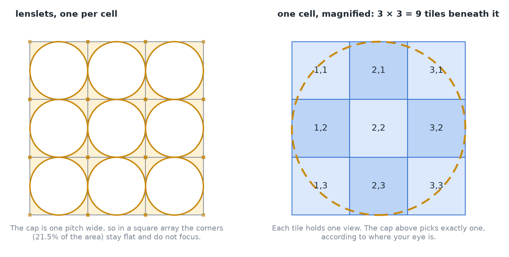

Each cap has a diameter of exactly one pitch, so neighbouring caps touch. Whatever the array can't
reach stays flat at base height, where it doesn't focus and contributes a little haze.

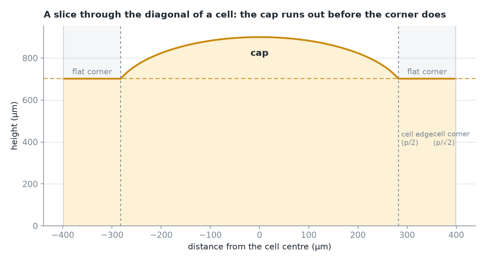

The alternative would be stretching each cap out to its cell corners so nothing is wasted. It's
tempting, and it's a trap: the sag would then be measured across the diagonal `p√2` instead of the
pitch, which raises the feasibility floor by √2 — from 0.847 mm to 1.20 mm at 45 LPI. For realistic
ink heights that's often the difference between working and not.

### Packing the caps

Circles don't tile a plane, so how you _arrange_ them decides how much of the sheet is left flat.
The **Lenslet packing** setting offers the two arrangements worth having:

| Packing               | Rows                                | Neighbours touched | Under a cap   | Left flat |
| --------------------- | ----------------------------------- | ------------------ | ------------- | --------- |
| Square grid           | square-on, one pitch apart          | 4                  | π/4 = 78.5%   | 21.5%     |
| Hexagonal _(default)_ | offset half a pitch, `p·√3/2` apart | 6                  | π/2√3 = 90.7% | 9.3%      |

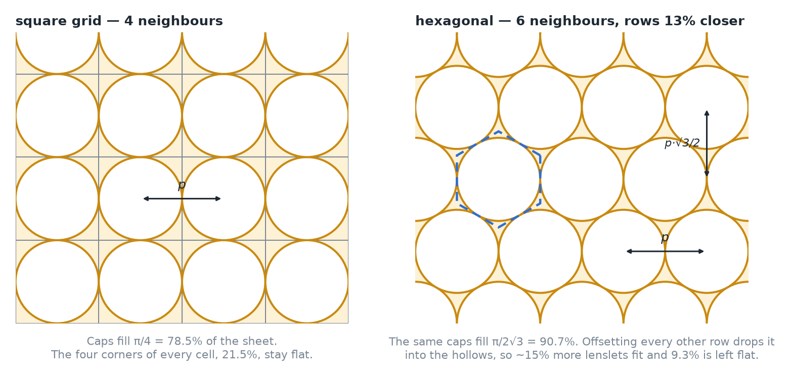

Hexagonal is the densest packing of equal circles that exists — a fact proved for the plane, not just
the best anyone has found. Shifting every other row by half a pitch lets the next row drop into the
hollows, so rows sit `√3/2 ≈ 0.866` of a pitch apart instead of a full one. Three things follow:

- **Less haze.** Under 10% of the sheet is flat instead of over 20%, so less than half as much light
  passes the array unfocused.
- **~15% more lenslets** in the same area (`1 / 0.866`), all of it in the vertical direction — a
  100 mm × 75 mm sheet at 45 LPI carries 177 × 153 lenslets instead of 177 × 133, so each view
  resolves that much taller.
- **A slightly bigger artwork file, and diagonal tile edges.** The closer rows need `1/(√3/2)` more
  pixels to keep two per tile vertically — 1228 px against 1063 at a 3 × 3 — and, more importantly,
  staggered rows put every tile edge on a diagonal, which no raster places exactly (see
  [two rasters](#two-rasters-two-jobs)). The artwork is not silently promoted to the printer's raster
  for it: 5669 px would place those edges to a printed dot rather than a fraction of a tile, and
  **Artwork px per view tile** is how you buy that if the staircase shows on your press.

Nothing else moves: the pitch, sag, radius, base and viewing cone are the same lens either way, and
the caps still touch (in hex they touch six neighbours instead of four). Reach for the square grid
when you're laminating a ready-made square lens array and the print has to line up with it.

Finding which lenslet covers a pixel stops being a floor-divide once the rows are offset, so the
renderer takes the nearest of the three candidate rows' centres — two rows away is more than a pitch
off vertically on its own, so three is always enough. Within a lenslet the view tiles are square in
millimetres on both axes, which keeps a view's angular slice the same horizontally and vertically; a
hex cell reaches slightly past a pitch at its top and bottom tips, and those clamp into the
outermost tiles.

### Naming the views

Every view is named for **where you stand to see it**:

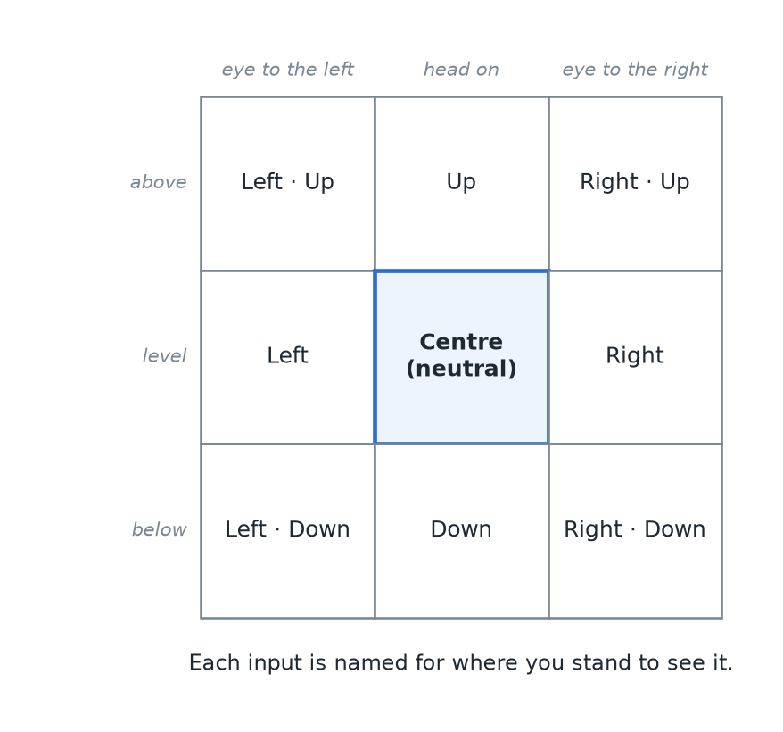

Words run out quickly. `Left`/`Right` covers a 3-wide grid, `Far left`/`Far right` a 4 or 5-wide one,
and past that the rank is simply numbered — the corner of a 15 × 15 is `Left 7 · Up 7`, and the middle
of any odd grid is `Centre (neutral)`.

The ports run out sooner than the names. Up to **4 × 4** the print node grows one input per cell, so
you can wire sixteen images by hand and let the node place them. Beyond that it doesn't: 25 handles on
one node is not a way anyone would wire a print, and 225 is not a node anyone can read. A bigger grid
takes the whole set on the single **All views** input, in the row-major order above, which is exactly
what **Model → Grid Views** puts on the wire. Where a cell does have a port, wiring it overrides that
one view, so you can feed the sequence and then retouch a single cell.

### The bit that will catch you out

A lens inverts. The ray arriving from your eye on the right crosses the axis and lands on the
**left** of the cell. So the view named "Right" has to be printed on the left tile.

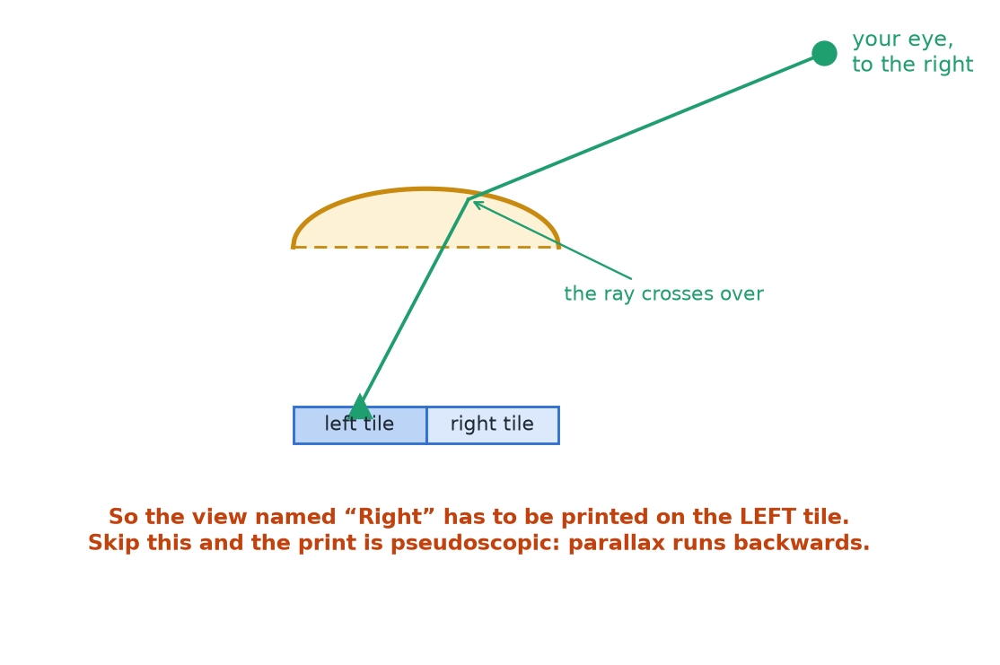

Get this wrong and the print is _pseudoscopic_: parallax runs backwards, depth turns inside out,
things that should come toward you recede instead. It isn't subtle and it isn't pleasant. The tool
mirrors both axes by default and only lets you switch it off for source material that's already
flipped.

### What the second axis costs

A lenticular quantises one axis and leaves the other alone. A grid quantises both, so each view is
cut down to one sample per lens in each direction:

| Arrangement       | Views | Artwork raster (100 mm, 45 LPI, 4:3) | Each view resolves to |
| ----------------- | ----- | ------------------------------------ | --------------------- |
| 1D, N = 2         | 2     | 709 × 532 px                         | 177 × 532             |
| 1D, N = 3         | 3     | 1063 × 797 px                        | 177 × 797             |
| 2D, 2 × 2, square | 4     | 709 × 532 px                         | 177 × 133             |
| 2D, 3 × 3, square | 9     | 1063 × 797 px                        | 177 × 133             |
| 2D, 2 × 2, hex    | 4     | 819 × 614 px                         | 177 × 153             |
| 2D, 3 × 3, hex    | 9     | 1228 × 921 px                        | 177 × 153             |
| 2D, 15 × 15, hex  | 225   | 5669 × 4252 px (at the PPI cap)      | 177 × 153             |

That's a 6× loss vertically at a square 3×3 grid — 5× at a hex one, which is what the closer rows buy
you — and it's why detail that survives a lenticular can vanish in a grid. In practice you want a
**higher** LPI for a grid — and conveniently, finer pitch also needs less ink height, so the two
constraints pull the same way for once.

Note what does _not_ change with N: **each view still resolves to one pixel per lenslet whatever the
grid size**, so 177 × 153 is the answer for a 2 × 2 and for a 15 × 15 alike. More views cost you
artwork raster and light per view, not sharpness. Hold on to that — it is what makes the depth budget
below affordable, and it is why the tool goes as far as **15 × 15 = 225 views**.

What does change is the artwork under each lenslet, which is cut into X × Y tiles: at 15 across a tile
is a fifteenth of the pitch on that axis, about 2.1 of the printer's dots at 1440 PPI. That is the
real ceiling, and the print node warns when a setting falls under two dots a tile — measured on
whichever axis is tighter.

### Oblong grids (X × Y)

**Views across** and **views down** are two settings, not one. A cell is one pitch each way whatever
you set, so the axis with fewer views simply gets wider tiles: each of its views covers more of the
cap, and therefore a larger slice of the same viewing cone. Nothing else in the optics notices.

That matters because parallax is rarely worth the same in both directions. A print hung on a wall is
walked past sideways and hardly ever stooped under, so views spent on vertical movement are views
nobody sees. A **6 × 2** grid gives six steps of horizontal look-around for twelve renders, where a
square grid carrying the same horizontal detail — 6 × 6 — costs thirty-six. The saving is real on
every axis of the pipeline at once: renders, artwork raster, and the light each view gets.

The cost of a sparse axis is the size of its steps. Both axes cross the whole cone, so 2 views down
step from one edge of it to the other in one jump: the vertical flip is abrupt, and anything with
depth doubles rather than glides as you rise or crouch. Fine when the sheet only needs to _switch_
vertically (a two-state indicator), wrong when it needs to _move_. The renderers report the parallax
per step on the sparser axis for exactly this reason — it is the one that will break first.

The producers take X and Y too: set **Model → Grid Views** or **Splat → Views** to the same pair as
the print node. One wire carries the cells in row-major order, and the two ends have to agree on how
many there are.

---

## Rendering the views from a model

If the subject is a 3D model rather than nine photographs, the views can be rendered — and the
rendering has to be done in a particular way, which is why the tool has its own renderer instead of
leaving you to a 3D package. Two nodes render views, and they share every rule below:

- **Model → Grid Views** fills the X × Y eye positions of a **lens grid**.
- **Model → Stereo Views** renders a horizontal run of views for a **1D lenticular**.

Both stand the subject entirely _behind_ the sheet, so the print is a window you look into rather
than a surface things float in front of — the grid occluding with its edges in two axes, the run in
one. That arrangement is worth a section of its own; see
[The window](#the-window-a-subject-behind-the-sheet) below.

### Shift the eye; never rotate it

The obvious approach is to point a camera at the subject from each of those positions. Don't. Aiming
the camera ("toe-in") gives every view a different keystone, and it introduces _vertical_ parallax
between views that should differ only horizontally. Under a lens grid that reads as a wobble as your
head moves, and no amount of care in the print will fix it.

Instead keep one view direction for every view and move only the eye position, across a plane
parallel to the sheet. Each view is then a shear of one projection. Concretely, with the eye at
(`eₓ`, `e_y`, `D`) and the sheet at z = 0, the ray to a point (`x`, `y`, `z`) crosses the sheet at

```
t = D / (D − z)
X = eₓ + t(x − eₓ)        Y = e_y + t(y − e_y)
```

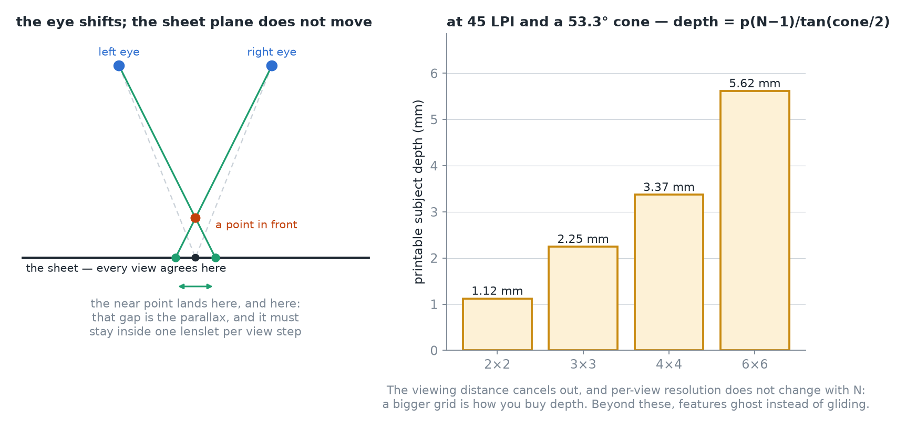

Set `z = 0` in that and `t` is 1, so `X = x`: **the eye cancels out.** Every view puts a point on the
sheet plane in exactly the same place, which is why that plane is the one that prints sharp no matter
how far you tilt. Off the plane `t ≠ 1`, the eye term survives, and that difference _is_ the parallax
— opposite in sign either side of the sheet, which is the near-things-move-the-other-way you can
verify by holding a finger up against a wall.

`t` earns its keep twice: it is `1/w` for this projection, so it interpolates linearly across a
triangle in screen space and doubles as the z-buffer key.

### The depth budget, which is smaller than you think

Under a lens grid each view is sampled **once per lenslet**. So a feature that moves more than about
one lenslet between adjacent views is never recorded in between: instead of gliding it jumps, and the
lens blur turns the jump into a double image. That gives a hard ceiling on usable depth.

Take it from the projection. The eye step between adjacent views is `s = 2D·tan(cone/2)/(N−1)`, and
∂X/∂eₓ = 1 − t, so a point `Z` behind the sheet moves `s·Z/(D + Z)` per step. The extreme is the
subject's **far face**, at `Z = setback + depth`. Set that movement to one pitch and solve, and for
the usual case of `D ≫ Z` the whole thing collapses:

```
usable depth behind the sheet  ≈  p · (N − 1) / (2·tan(cone/2))
```

**The viewing distance very nearly cancels out.** Depth is set by the pitch, the cone and the grid —
nothing else. At the defaults (45 LPI, 0.9 mm, RI 1.5, so a 53.3° cone, viewed from 400 mm) the
implementation gives:

| Grid    | Printable subject depth | Widest eye step |
| ------- | ----------------------- | --------------- |
| 2 × 2   | 0.56 mm                 | 402 mm          |
| 3 × 3   | 1.13 mm                 | 201 mm          |
| 4 × 4   | 1.64 mm                 | 138 mm          |
| 6 × 6   | 2.64 mm                 | 86 mm           |
| 10 × 10 | 4.62 mm                 | 49 mm           |
| 15 × 15 | 7.12 mm                 | 32 mm           |

Those come out slightly under the closed form above at the larger grids — 7.12 mm against the 7.9 mm
it predicts for a 15 × 15 — and the reason is worth knowing. The views are spread evenly in _angle_
across the cone, so their eye positions land at `D·tan(θ)`, which is not evenly spaced on the plane:
the outermost pair sits further apart than the middle ones. The step that decides whether the print
ghosts is the widest one, so the honest figure is a little below the average-step estimate, and the
gap grows with the grid.

(The factor of two against the older, straddling arrangement is real and is the price of the window:
a subject that straddles the plane is only ever half a depth off it, while one standing behind it is
a whole depth off at the back. What the window buys back — occlusion by the sheet's own edges, and no
window violations — is worth more than the millimetre. See [The window](#the-window-a-subject-behind-the-sheet).)

One millimetre, for a 100 mm print. That is the single most surprising number in this document, and
it is not a limitation of the implementation — it is what one sample per lenslet per view means. Three
ways to buy more, in order of how much they cost you:

1. **A bigger grid.** Depth grows with `N − 1` and per-view resolution doesn't change at all, so this
   is nearly free — you pay in artwork raster, in render time, and in light split more ways. It is
   also the one with a hard stop, and it is not a matter of taste: the artwork under a lenslet is
   divided into X × Y tiles, so a tile gets `pitch_px / X` of the printer's own dots across and
   `pitch_px / Y` down. Under about two dots the tiles bleed into each other and the print stops
   switching at all. At 1440 PPI and 45 LPI a lenslet is 32 dots across, so **15 is the ceiling on
   each axis** — which is where the tool caps it, and where the depth table above stops. Note that
   depth is bought per axis: growing only X buys look-around only sideways
   ([Oblong grids](#oblong-grids-x--y)).
2. **A coarser pitch.** Depth grows with `p`, but coarse lenses need
   [thick ink](#when-it-cant-work) and you lose resolution one-for-one.
3. **A narrower cone.** Fewer degrees to look around in, but every degree carries more depth.

And one that costs nothing at all: **keep the setback near zero.** What the ceiling measures is a
face's distance from the sheet plane, so every millimetre of gap behind the glass is a millimetre the
subject cannot use — and a negative setback spends the budget from the other end, since the part in
front moves faster than the same distance behind would. See
[Breaking the window on purpose](#breaking-the-window-on-purpose).

The render node reports the parallax per view step in lenslets and warns past 1.5 of them, with the
depth it suggests instead. Treat that line as the one to satisfy before printing anything — and then
read the next section, because the failure is more interesting than a failure usually is.

### Overshooting on purpose: the depth haze

The warning says the print will ghost. That is true, but it undersells what actually happens, and the
difference is worth knowing before you obey it.

When a feature moves more than a lenslet between adjacent views, the lens has no sample for where it
was in between, and it shows you a blend of the two positions instead — the same feature, twice,
softly. What matters is that **the amount of it grows with depth**: disparity is `s·Z/(D + Z)`, so the
near face barely blurs while the far face blurs the most, smoothly and monotonically in between.

That is precisely the profile of atmospheric haze. Aerial perspective — distant things paler, softer
and lower in contrast than near ones — is one of the oldest depth cues in painting, and one of the
strongest the eye has. A print that overshoots its parallax budget produces it for free and in the
right direction: **the deeper something sits in the window, the mistier it reads.** Rather than
looking broken, a mild overshoot often looks like air.

So the budget is a guideline with a usable soft edge:

| Parallax at the far face | What it looks like                                                             |
| ------------------------ | ------------------------------------------------------------------------------ |
| under ~1 lenslet         | crisp everywhere — every plane resolves                                        |
| ~1 – 2.5 lenslets        | a soft veil that deepens with distance; reads as haze, and as _more_ depth     |
| ~2.5 – 4 lenslets        | visibly soft at the back; fine detail there is gone, silhouettes still hold    |
| beyond that              | discrete doubling — two copies of an edge, not a veil, and it reads as a fault |

Three things decide which side of that line you land on:

- **Contrast and edges.** A smooth, low-contrast, textured surface hazes gracefully. A hard black
  line on white at the far face doubles visibly at a fraction of the same disparity, because the eye
  is reading one edge as two rather than one soft one.
- **Where the detail is.** The window fits the subject at its **near face**, which sits on or near
  the sheet plane and therefore prints sharp. Put what the picture is about there — a face, a
  product, a logo — and let the haze fall on what is behind it. That is exactly how a photograph with
  a hazy background is composed, and it is why the arrangement holds up.
- **How far past you are.** The near face is unaffected no matter how deep the box is, so a subject
  can be several times the "printable" depth and still have a sharp front. What you lose is the back.

None of this is a licence to ignore the figure — it is the figure that tells you which row of that
table you are in. But if you have a scene rather than an object, deliberately overshooting by two or
three times and letting the distance go soft will usually read deeper than a scene compressed to
stay crisp.

### Compress the projection, not the model

Fitting a solid to a millimetre of depth by squashing its geometry ruins it: squashed geometry has
squashed _normals_, so a cube flattened to a millimetre shades exactly like the slab it has become —
three faces at one flat grey, no solidity at all.

So the renderer fits the model to the sheet with its proportions intact, computes shading from that
true shape, and compresses z **only when projecting**. Shading cues stay at full strength while the
parallax stays printable. This is not a trick invented for lens prints: it is what a bas-relief does,
and sculptors have been doing it since Donatello.

### Where the colour comes from

STL carries shape and nothing else, so an STL prints in one flat material colour. **OBJ** carries two
more things, and the tool reads both:

- **Texture coordinates** (`vt`, referenced from the face lines). The texture image itself arrives on
  a **wire**, not from the file. That is deliberate: a `.mtl` names a third file for the image, and a
  browser handed one uploaded file can fetch neither — while in a node graph the map wants to be a
  wire anyway, so anything that makes an image can feed it.
- **Vertex colours** (`v x y z r g b`). Used when no texture is wired, which is how the
  six-coloured-faces cube in the examples works: each face gets its own four corners, so its colour
  stays flat rather than blending into its neighbours.

Whichever applies replaces the material colour rather than tinting it — a photographic texture must
not be quietly dyed by whatever the colour swatch happens to be set to — and both are interpolated
perspective-correctly, so a texture doesn't swim across a face tilted away from you.

### Nothing needs to be rendered large

One pixel per lenslet per view means 177 × 133 at the defaults, whatever the grid size. The node
renders 512 wide out of the box, which is already generous, and warns if you go below what the print
resolves. A 3D package rendering 4K views for this is wasting nine tenths of the pixels — and that
waste is multiplied by N², which is what makes a 15 × 15 affordable here and painful anywhere else.

### The window: a subject behind the sheet

The obvious arrangement is to let the subject straddle the sheet plane — half of it in front, half
behind — and that does squeeze the most depth out of a given parallax budget. Both renderers do
something else: they put the subject **entirely behind the plane**, so the sheet is a window you look
into rather than a surface things float in front of. **Model → Stereo Views** does it over one axis,
**Model → Grid Views** over two.

That is not a stylistic preference. Three things follow from it, and the third is the one that costs
something.

**Nothing can be cut off while appearing to float in front of the paper.** An object that reads as
nearer than the sheet but is clipped by the sheet's edge asks the eye to believe two contradictory
things at once — the edge is in front of it (it cuts it off) and behind it (it looks nearer). This is
the classic _window violation_, and it is the single most uncomfortable thing a stereo print can do.
A subject that never crosses the plane cannot commit it.

**The frame occludes, exactly as a real window does.** Off-axis, the subject shifts behind a fixed
aperture, so the edges of the sheet cover and uncover it as you move. That is a strong depth cue —
arguably the strongest in the picture — and it costs nothing to have: it is what the paper's own
edges do once the geometry is right. A grid gets it in both axes at once, top and bottom edges
included, which is the one thing it can do that a 1D print cannot.

**Disparity is gentler for the same depth.** Reuse ∂X/∂eₓ = 1 − t with `t = D/(D − z)`. A point in
front of the sheet at `z = +Z` moves `s·Z/(D − Z)` per eye step; a point behind at `z = −Z` moves

```
s·Z / (D + Z)
```

`D − Z` shrinking against `D + Z` growing. At the tool's 400 mm viewing distance a point 10 mm off
the plane moves about 5% less per step behind the glass than in front of it, and the gap widens fast
as it recedes. Depth behind the plane is simply cheaper, millimetre for millimetre, than depth in
front of it.

Cheaper per millimetre, note — not cheaper overall, because the far face is now a whole depth off the
plane instead of half of one. That is the factor of two in the depth table above, and it is why the
number to watch is the far face's distance from the sheet rather than the subject's thickness. What
carries the stereo example's 6 mm against the 3×3 grid's 1 mm is mostly its extra views: twelve of
them across the same cone, so a step a third the size.

#### What it costs: the subject gets smaller

Perspective does not stop applying because the arrangement is convenient. Seen from the eye, a
subject `Z` behind the window subtends `D/(D + Z)` of what it would at the glass. Fit the model to
the sheet and _then_ push it back, and it no longer fills the frame — the window has a border round
it that nobody asked for.

So the fit is scaled by the reciprocal:

```
scale = (D + Z) / D
```

and `Z` is taken at the **near face** of the subject, not its middle. The near face is the plane that
projects largest, so fitting there is the one choice that guarantees nothing spills past the edge of
the aperture. At the default setback of zero the factor is exactly 1 — the nearest point of the
subject touches the glass and fills the frame, and everything deeper falls away inside it, which is
what a box seen through a window looks like.

#### Breaking the window on purpose

Everything above argues for keeping the subject inside the box. There is one exception worth having,
and both render nodes allow it: **Setback may be negative.** At −2 the nearest 2 mm of the subject
stands _in front_ of the sheet and the other 28 mm of a 30 mm subject is still behind it. A nose in
front of the glass, on a head that is still in the box.

Nothing in the maths needs changing. The near face is at `z = −setback`, which is simply positive
now; the fit scales by `(D + Z)/D` with a negative `Z`, so it scales the subject _down_ instead of up
(a plane in front subtends more, not less); and the disparity formula carries the sign itself. Two
things do change in how it reads:

- **The window violation is back, for the part that crosses.** Anything in front of the plane that
  the sheet's own edge cuts off asks the eye to believe the edge is both in front of it and behind
  it. The fix is compositional, not numerical: keep the part that pokes out small, and keep it away
  from the border. A subject that comes 2 mm out in the middle of a 100 mm sheet never goes near an
  edge, and the effect is free.
- **The sharp plane moves into the subject.** What prints sharp is always the sheet plane, and it now
  cuts through the model rather than sitting at its front. Choose the crossing so that the plane lands
  on what you want crisp.

The parallax figure follows the worse of the two faces, which is not always the far one: `Z/(D − Z)`
grows faster in front of the sheet than `Z/(D + Z)` does behind it, so a subject brought far enough
out is limited by its nose rather than its back. Info names the face it is quoting. The renderer also
refuses to bring the near face closer than a quarter of the viewing distance, where the projection
stops meaning anything.

#### Ordering the views for the lens

The renderer hands back the run **left eye first**, which is honestly what an eye in each position
sees. That is not what gets printed. A lenticule shows its leftmost strip to an eye on the _right_,
and **Lenticular Print** interlaces frames in the order they arrive — so the node reverses the run
before sending it. Get this backwards and the print is _pseudoscopic_: the parallax runs the wrong
way, near things move like far ones, and the whole picture turns inside out. The switch is under
Advanced (_Order for the lens_) precisely because the only way to be certain which way your own
press ends up is to print one and look at it.

---

## Calibrating

Three things are known imprecisely in real life: your varnish's actual refractive index, the height
your printer really lays down versus what you asked for, and (for a laminated hybrid) the real lens
pitch. Each gets a swept test sheet.

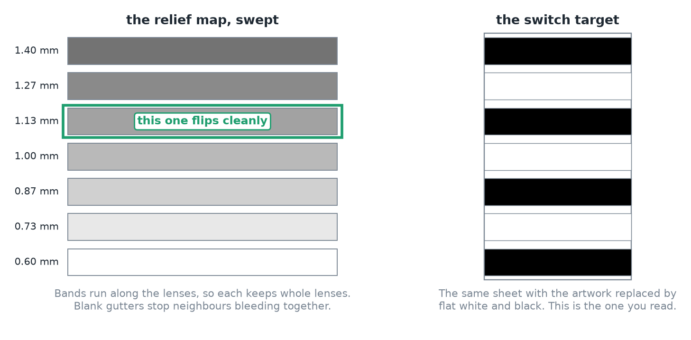

Every calibration download gives you three files on the same raster: the interlaced artwork swept
across bands, a **switch target** with the artwork replaced by flat white and black, and the 16-bit
relief. The switch target is the one you actually read — it shows you _where_ the print flips with
none of your artwork's detail in the way.

**Reading it:** print, cure, and look at the switch target from your intended viewing distance while
moving your head across the parallax axis. The right band is the one that flips **cleanly and
uniformly across its whole width** — all black, then all white, with no banding, no gradient
sweeping across, no ghost of the other state.

### The pitch sweep needs a trick

The obvious way to sweep LPI is to hold the height fixed and vary the pitch. That's wrong twice over.
It varies the viewing cone as well as the pitch, so the bands aren't comparable; and the coarse bands
may fall below the feasibility floor and not focus at all, so you'd be judging a broken lens against
working ones.

Because the cone depends only on the ratio `(p/2)/H`, giving each band its own height in proportion
to its pitch fixes both problems at once — every band gets the same cone, and since the floor scales
with pitch identically, every band focuses:

```
H_band = H_reference × LPI_reference / LPI_band
```

| Band   | Pitch    | Height    | Cone   | Focuses? |
| ------ | -------- | --------- | ------ | -------- |
| 40 LPI | 0.635 mm | 1.0125 mm | 53.34° | yes      |
| 45 LPI | 0.564 mm | 0.9000 mm | 53.34° | yes      |
| 50 LPI | 0.508 mm | 0.8100 mm | 53.34° | yes      |

Since the relief is normalised against the tallest stack on the sheet, the finer bands — which need
less ink — simply come out darker. So the sheet also tells you what each candidate pitch will cost
you in height.

---

## The numbers, at the defaults

100 mm wide, 1440 PPI, 45 LPI, 0.9 mm of gloss, index 1.5, no rotation, no phase. Raster sizes assume
a 4:3 source, since the sheet takes its aspect ratio from the first view. Every value here comes out
of the reference implementation.

| Quantity                | Value                                   |
| ----------------------- | --------------------------------------- |
| Lens pitch              | 0.5644 mm (32.00 printer pixels)        |
| Minimum feasible height | 0.8467 mm — so 0.9 clears it by 6.3%    |
| Radius of curvature     | 0.3000 mm                               |
| Lens sag                | 0.1983 mm                               |
| Flat base beneath       | 0.7017 mm                               |
| Focus below apex        | 0.9000 mm (equal to H, by construction) |
| Viewing cone            | 53.34° (ceiling at this index: 56.6°)   |
| Lenses across the sheet | 177                                     |
| Relief raster           | 5669 × 4252 px — 24.1 MP                |
| Artwork raster, 3 views | 1063 × 797 px — 0.85 MP                 |
| 16-bit height step      | 0.0137 µm                               |

And for the 2D grid at those same defaults, where the numbers stop being about the lens and start
being about how many views it is asked to carry:

| Quantity                                     | 3 × 3   | 15 × 15 (the ceiling) |
| -------------------------------------------- | ------- | --------------------- |
| Views                                        | 9       | 225                   |
| Each view resolves to (hex)                  | 177×153 | 177×153               |
| Printer dots per view tile                   | 10.67   | 2.13                  |
| Widest eye step, viewed from 400 mm          | 201 mm  | 32 mm                 |
| Subject depth behind the sheet, at 1 lenslet | 1.13 mm | 7.12 mm               |

A quick consistency check on the two ways of writing the radius: `H(n−1)/n = 0.9 × 0.5 / 1.5 =
0.300000`, and from the solved sag via the chord, `0.300000`. They agree to six decimals, as they
have to.

---

## Doing it yourself

### What you need

- A **UV flatbed** with a clear/varnish channel that can build to at least a millimetre or so, and a
  RIP that takes a greyscale height map for it.
- **Cured clear ink** whose refractive index you can look up or measure. Most UV clears are near 1.5.
  If the datasheet is silent, calibrate for it.
- A flat, dimensionally stable substrate.
- N images that differ only by viewpoint — rendered from a 3D scene, shot on a camera slider, or
  taken as the frames of an animation. For a flip or a loop rather than a depth effect they needn't
  be viewpoints at all; any N frames that read as a sequence will do, and an animated GIF is the
  easiest source of them.

### In this tool

1. Add a **Lenticular Print** node (or **Lens Grid Print** for 2D), plus a source of views: one
   **Image Input** per view, or a single **Animation Input** whose `Frames` output carries a whole
   decoded animation down one wire.
2. Connect them. For the lenticular node connection order is viewing order. For the grid node each
   port is named for the direction it's viewed from — connect by name and let the node handle the
   mirroring. Above a 4 × 4 there are no per-cell ports: feed the whole grid into **All views** from
   **Model → Grid Views**, or from anything else that produces a sequence in row-major order.
3. If the subject is a mesh rather than a set of photographs, use **Model → Stereo Views** (1D) or
   **Model → Grid Views** (2D) to render it, and read the parallax figure in that node's Info before
   anything else — see [rendering from a model](#rendering-the-views-from-a-model).
4. Set width, PPI, LPI, height and RI. On the grid node also pick **Lenslet packing** — leave it
   hexagonal unless you are lining the print up with an existing square array. Watch the **Info**
   output: it reports the solved sag, base, focus and cone, which raster the artwork landed on and
   why, and warns you if the combination can't focus or if the grid has outrun the printed dot.
5. Press **Run**.
6. Open the node's editor and download the **16-bit gloss depth map**. The `interlaced` output is
   your artwork; the `depth` output is an 8-bit preview only — don't print that one.
7. Before committing to a real print, download the **calibration sheets** and read them as above.

### From scratch

The whole method is about sixty lines of arithmetic. Nothing here needs this repository:

```python
# ---- inputs ---------------------------------------------------------
#   views[]      N source images, in viewing order
#   width_mm     printed width;  PPI, LPI, H (mm), n, phase, q
#   o            orientation in RADIANS
o          = radians(orientation_deg)
height_mm  = width_mm * views[0].height / views[0].width   # sheet aspect
frac       = lambda x: x - floor(x)

# ---- solve the lens -------------------------------------------------
p      = 25.4 / LPI
H_min  = n * p / (2 * (n - 1))
disc   = H*H*(n-1)**2 - n*n*p*p/4
if disc < 0:
    warn(f"cannot focus in {H} mm; need at least {H_min} mm")
    s = p / 2                      # hemisphere, the strongest lens
else:
    s = (H*(n-1) - sqrt(disc)) / n # minor arc — the printable root
R      = (s*s + (p/2)**2) / (2*s)
b      = max(0, H - s)

# ---- interlaced artwork ---------------------------------------------
cells      = width_mm / p
map_w      = round(width_mm / 25.4 * PPI)        # the printer's own raster
want       = max(ceil(cells * N * q),            # every strip of every lens
                 max(view.width for view in views))     # keep the sources

# …then round the pitch so every lens gets the same whole number of pixels,
# or the sheet wipes instead of flipping. Whole pixels per *strip* if the
# press can carry it, whole pixels per *lens* if it cannot.
per_lens   = max(N, ceil(want / cells / N - 1e-9) * N)   # nudged: see below
if round(cells * per_lens) > map_w:
    per_lens = max(1, round(map_w / cells))
    while per_lens > 1 and round(cells * per_lens) > map_w:
        per_lens -= 1
art_w      = round(cells * per_lens)
if art_w > map_w:                                # a lens thinner than a pixel
    art_w  = round(map_w)
art_h      = round(art_w * views[0].height / views[0].width)
mm_per_px  = width_mm / art_w

for py in range(art_h):
  for px in range(art_w):
      x, y = (px + 0.5) * mm_per_px, (py + 0.5) * mm_per_px
      u    =  x*cos(o) + y*sin(o)
      v    = -x*sin(o) + y*cos(o)
      sig  = u / p + phase
      j, t = floor(sig), sig - floor(sig)
      k    = min(N - 1, int(t * N))
      u_c  = (j + 0.5 - phase) * p              # sample at the LENS CENTRE
      sx, sy = u_c*cos(o) - v*sin(o), u_c*sin(o) + v*cos(o)
      art[py][px] = bilinear(views[k], sx / width_mm, sy / height_mm)

# ---- relief map (printer raster, 16-bit) ----------------------------
map_h      = round(map_w * views[0].height / views[0].width)
mm_per_px  = width_mm / map_w

for py in range(map_h):
  for px in range(map_w):
      x, y = (px + 0.5) * mm_per_px, (py + 0.5) * mm_per_px
      u    = x*cos(o) + y*sin(o)
      t    = frac(u / p + phase)
      d    = (t - 0.5) * p
      z    = b + max(0, sqrt(max(0, R*R - d*d)) - (R - s))
      depth[py][px] = round(min(1, z / H) * 65535)
```

For the 2D version: compute `v` as well, quantise it the same way to get a row index, use
`d = hypot(d_u, d_v)` with `z = b` wherever `d > p/2`, and mirror both view indices. For hexagonal
packing, divide `v` by `p·√3/2` instead of `p`, offset odd rows by half a pitch, take the nearest of
the three candidate row centres — and treat `diagonal` as true, staggered rows being diagonal by
construction.

This listing isn't decorative — it's pinned. `src/lib/docsPseudocode.test.ts` is a literal port of it,
asserted to produce **byte-identical** output to the real renderers at an awkward configuration: 23°
orientation, phase 0.3, three views, odd pixel dimensions. If the code and this page ever drift
apart, that test fails.

### Printing

1. Print the artwork in colour, scaled to the physical width you specified.
2. Print the relief on top in clear ink, at the same physical width, from the 16-bit map. Check that
   your RIP's white-equals-what-height setting matches what the map was normalised to.
3. Cure it properly. Under-cured ink slumps, and a slumped lens is a longer-focus lens.

---

## When it goes wrong

| What you see                                    | Probably                                                                                                       | Try                                                                                                             |
| ----------------------------------------------- | -------------------------------------------------------------------------------------------------------------- | --------------------------------------------------------------------------------------------------------------- |
| Soft everywhere, never a clean flip             | Focus isn't landing on the artwork                                                                             | Check the feasibility floor; run the Height calibration                                                         |
| Clean at one edge, smeared at the other         | Pitch mismatch (laminated lens, or RIP scaling)                                                                | Run the LPI calibration                                                                                         |
| Two views visible at once                       | Focus too long, or the ink slumped                                                                             | More height, or cure harder                                                                                     |
| Depth inverted, motion feels wrong              | Pseudoscopic — views not mirrored                                                                              | Mirror both view indices                                                                                        |
| Stair-stepping on the lens surface              | 8-bit relief, or too few pixels per lens                                                                       | Emit 16-bit; raise PPI or lower LPI to ≥ 8 px per lens                                                          |
| A view missing from some lenses                 | Artwork raster too small, a tile fell between pixels                                                           | Raise samples per tile to 2 or more                                                                             |
| Image slides sideways as it flips               | Sampling per-pixel instead of at the lens centre                                                               | See [interlacing](#interlacing)                                                                                 |
| Ragged, regularly-stepped view edges            | Diagonal strips or tiles on a small artwork raster                                                             | Raise Artwork px per strip / view tile, up to the PPI cap — see [above](#except-when-the-strips-run-diagonally) |
| Contrast lower than expected (2D only)          | Sheet left flat between the caps: 21.5% square                                                                 | Switch to [hex packing](#packing-the-caps) for 9.3%, or raise LPI                                               |
| Never switches at all, mush at every angle (2D) | Too many views for the lenslet: under ~2 printed dots per view tile                                            | Smaller grid, lower LPI, or raise PPI — Info gives the figure                                                   |
| Doubled edges rather than depth, from a model   | Well past the budget — over ~4 lenslets per view step                                                          | Less subject depth or setback, a bigger grid, or raise LPI                                                      |
| The back of the subject soft, the front sharp   | 1.5–4 lenslets per step: the [depth haze](#overshooting-on-purpose-the-depth-haze), which may be what you want | Nothing — or less depth, if the back has to be crisp too                                                        |

---

## What this doesn't do

Worth being straight about:

- **The optics are paraxial.** The focus used here is the paraxial focus of a single refracting
  surface. A real spherical cap at these apertures has noticeable spherical aberration — the edge
  rays focus shorter than the middle ones, so the flip is softer at the edge of the cone than in the
  centre. An aspheric profile would fix it, and the profile equation is the only thing that'd change.
- **No chromatic correction.** Index varies with wavelength, so the flip point differs slightly by
  colour.
- **Ink isn't glass.** Cured varnish shrinks and slumps and may not hold the shape you modelled. That
  gap is exactly why the calibration sheets exist.
- **Resolution.** One sample per lens, per view — and in 2D, per lens in both axes. That's intrinsic
  to the technique, not a limitation of this implementation.
- **Your printer is not the author's.** This has been printed: the technique works on a physical UV
  flatbed, and the guide reflects what came off it — the
  [diagonal-raster problem](#except-when-the-strips-run-diagonally) above is the kind of thing that only
  turns up that way. But height, index and slump are properties of _your_ machine and _your_ varnish,
  and the whole reason the calibration sheets exist is that nobody can hand you those three numbers.
  Print them first; treat them as mandatory, not optional.

---

## Where the code is

| Topic                    | Implementation                                                                                     |
| ------------------------ | -------------------------------------------------------------------------------------------------- |
| The lens solve           | `lensGeometry()`, `heightForViewAngle()` in `src/lib/lenticular.ts`                                |
| Interlacing              | `renderInterlaced()`                                                                               |
| The two rasters          | `interlacedSize()`, `outputSize()`                                                                 |
| The relief map           | `renderDepthMap()`                                                                                 |
| 16-bit PNG               | `encodeGray16Png()` in `src/lib/png16.ts`                                                          |
| The 2D grid              | `renderGridInterlaced()`, `renderGridDepthMap()`, `gridCellLabel()`                                |
| Grid size and its ports  | `MIN_GRID`/`MAX_GRID`/`clampGrid()`, `lensGridInputs()` in `src/engine/ports.ts`                   |
| Oversize renders         | `MAX_OUTPUT_PIXELS`, `OversizeOutputError`, `*Chunks()` generators, `runChunked()` in `chunked.ts` |
| Square vs hex packing    | `latticeAt()`, `HEX_ROW_SPACING`, `packingFill()`                                                  |
| Calibration              | `calibrationValues()`, `withCalibrationValue()`, `switchFrames()`, `gridSwitchViews()`             |
| Rendering from a model   | `src/lib/render3d.ts` — `projectToSheet()`, `eyeOffsetsMm()`, `disparityPerStep()`                 |
| The window               | `renderViewGrid()`, `renderViewSequence()`, `disparityAtDepth()`, `fitAtZMm`                       |
| Reading a mesh in        | `parseMesh()` in `mesh.ts` → `parseStl()` / `parseObj()`                                           |
| The nodes                | `src/nodes/lenticular.ts`, `lensGrid.ts`, `radialGrid.ts`, `model3d.ts`, `modelStereo.ts`          |
| The numbers on this page | `src/lib/lenticular.test.ts`                                                                       |
| The figures              | `docs/figures.py` — run `python docs/figures.py` to redraw them                                    |

---

## Prior art and licence

Lenticular printing is old. Interlacing images into strips behind a ruled cylindrical sheet goes back
to the early twentieth century, and Lippmann described integral photography — a 2D array of lenslets
over a 2D array of small images — in 1908. None of the interlacing here is new, and this page doesn't
claim otherwise.

What it does set out carefully is the case where the lens is _printed onto_ the image rather than
laminated over it, so that the apex-to-image distance is the ink stack itself. That's what produces
the closed-form solve, the feasibility floor, the scale-invariance of the cone, the angle-matched
pitch sweep, and the two-raster split described above.

All of it is published freely under this repository's MIT licence, as a defensive disclosure: no
patent is sought or asserted on any of it, and it's written out in this much detail specifically so
that it stays available to everyone.
